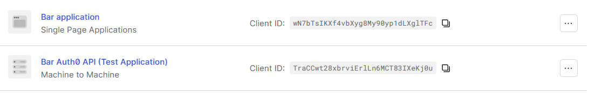
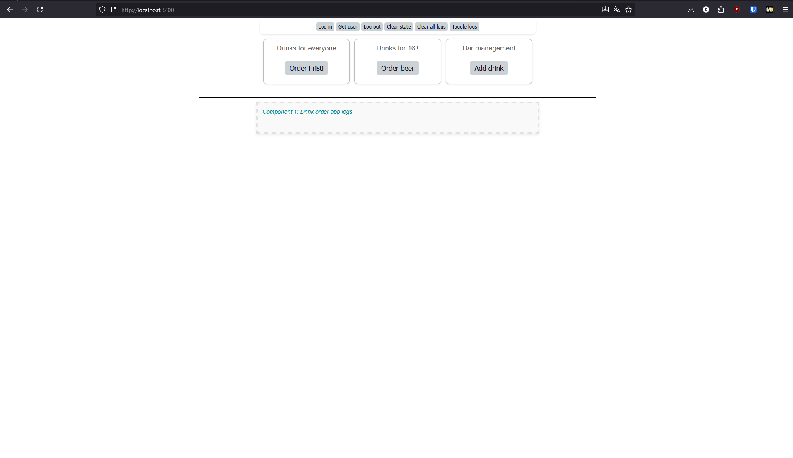
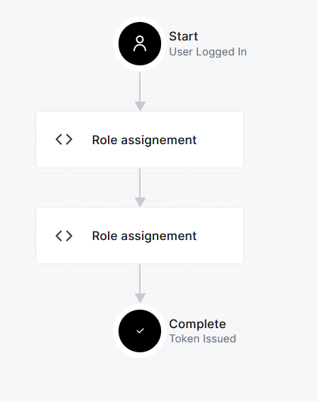
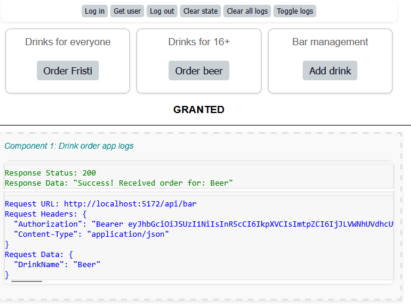
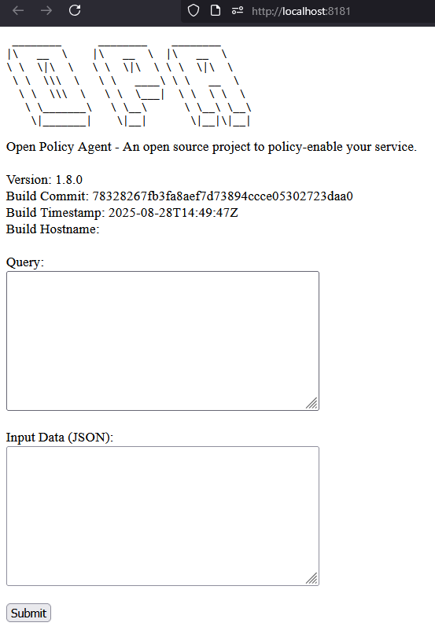

# Project 1 - Open Policy Agent (OPA)

## Threat model

## 1. Auth0 opzetten

Het opzetten van Auth0 verliep verbazend vlot. Ik merkte wel dat het soms wat langer zoek was welke stappen in de bijgeleverde pdf uitgevoerd werden. Sinds dat de stappen zijn opgesteld in de pdf zijn er een aantal dingen in de UI verandert. Alles bestaat dus nog wel, het was soms gewoon iets meer zoeken naar het juiste menu'tje.



## 2. Single Page Application (SPA) opzetten

Ook het opzetten verliep origineel ook redelijk vlot. Wel moet je goed opletten bij het aanmaken van de `.js` files, omdat een fout hierin er makkelijk voor kan zorgen dat de applicatie niet werkt.



Wel ben ik problemen tegengekomen bij het opzetten van het project op mijn desktop. Poort 3000 waarop de SPA runt wilde maar niet binden aan de container. Na langer zoeken dan ik toe wil geven, dacht ik eindelijk aan om eens te checken of er iets anders op poort 3000 runt. En natuurlijk was dit het probleem. Na de port bind snel in de compose te veranderen starte de SPA direct op.

## 3. De SPA met de API connecteren

Het werkende krijgen van de SPA en de API tesamen vroeg wat meer werk. Ik kon relatief makkelijk inloggen met mijn user, maar dan gaf de API geen antwoord als ik een drankje wilde bestellen.

Na lang zoeken bleek uiteindelijk dat ik bij het maken van de post login trigger 2 keer role assignement in de workflow had gestoken. Na dit aan te passen kon de SPA perfect en correct met de API praten.



Het poort probleem dook hier ook weer op. Om de API correct met de SPA te laten praten, moest ik de CORS origin nog even snel aanpassen. Dit was snel gebeurd en alles werkte daarna correct.



## 4. OPA opzetten

Om de OPA op te zetten werden we op weg geholpen met een stukje compose. Bij het initieel opstarten kwamen er echter enkele problemen naar boven. Doordat ik initieel een leeg REGO bestand had gebindmount, zorgde dit ervoor dat de container vastliep. Door de volgende lijn code aan de REGO file toe te voegen, was dit snel opgelost.

```rego
default allow = true
```

Nadat dit opgelost was, was de container nog altijd onbereikbaar. Dit is blijkbaar omdat de OPA container niet standaard op alle adressen luisterd. Dit moet nog gedefinieerd worden bij de commands in de compose.



## 5. Authorisatie van de API naar de OPA verplaatsen


Om de het project correct te laten functioneren moest de dotnet versie geüpgrade worden naar 8.0 of hoger.

## 6. Simpele REGO file

## 7. Geavanceerde REGO file

## 8. Finale REGO file

## 9. Token validatie logica van de API naar de OPA verplaatsen
